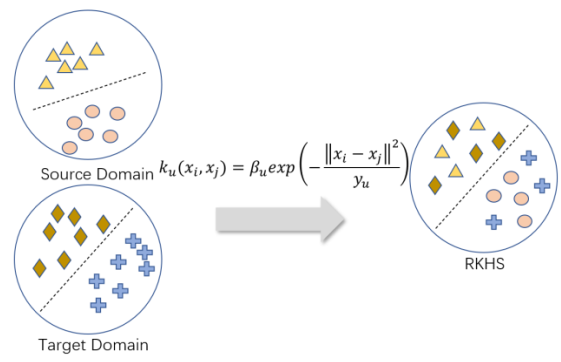
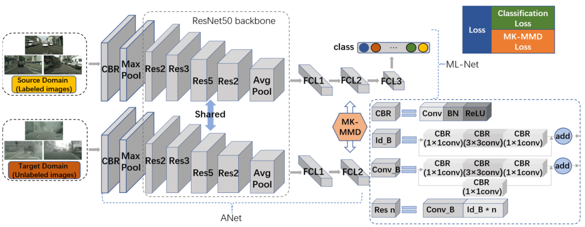
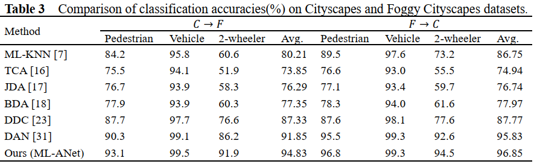
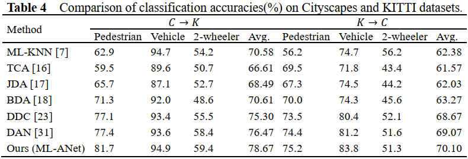

# Implementation of paper "ML-ANet: A Transfer Learning Approach Using Adaptation Network for Multi-label Image Classification in Autonomous Driving" from Chinese Journal of Mechanical Engineering

Deep learning algorithms have achieved outstanding performance in a variety of computer vision tasks, including multi-label classification of images in the field of autonomous driving. However, the effectiveness of these algorithms highly depends on reliable ground-truth labels that require extensive human labor work, and usually the learned classifiers can only have satisfactory performance on the same distribution with
unsound robustness. Our approach is to address this problem.

## Approaches

To address this problem, a new multi-label adaptation network (ML-ANet) based on multiple kernel variants with maximum mean discrepancies was proposed, which significantly reduced the discrepancy between the source and target domains. The hidden representations of the task-specific layers in ML-ANet were embedded in the reproducing kernel Hilbert space (RKHS), and then the mean-embeddings of specific features in different domains could be precisely matched. Multiple kernel functions were used to make feature distribution more effortless to perform mean embedding matching explicitly, which can further reduce domain discrepancy.




## Evaluation

We evaluated our newly proposed approach based on three driving datasets including Cityscapes, Foggy Cityscapes, and KITTI. The
results show that ML-ANet is effective for multi-label image classification in different domains with biased data distribution.




## How to use code
### Requirement

 ```
    pip install -r requirements.txt
```

### Training

```angular2
    python train.py
```

## Citations

If this project is helpful to your research, please cite this below.
```angular2
    Stay tuned
```
